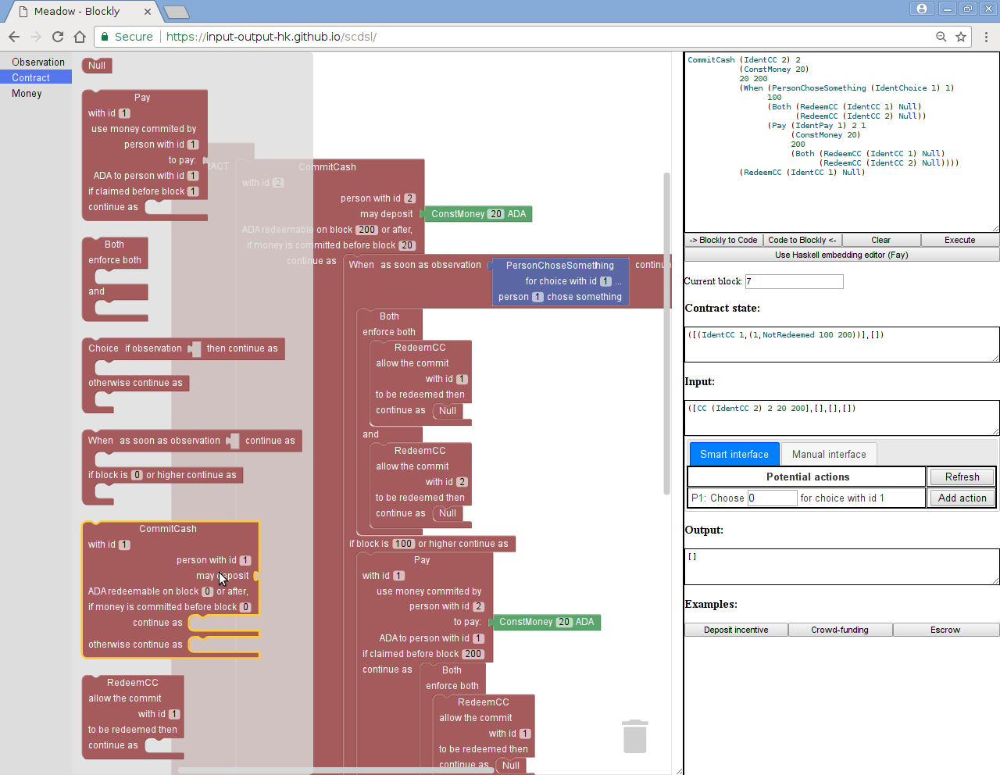
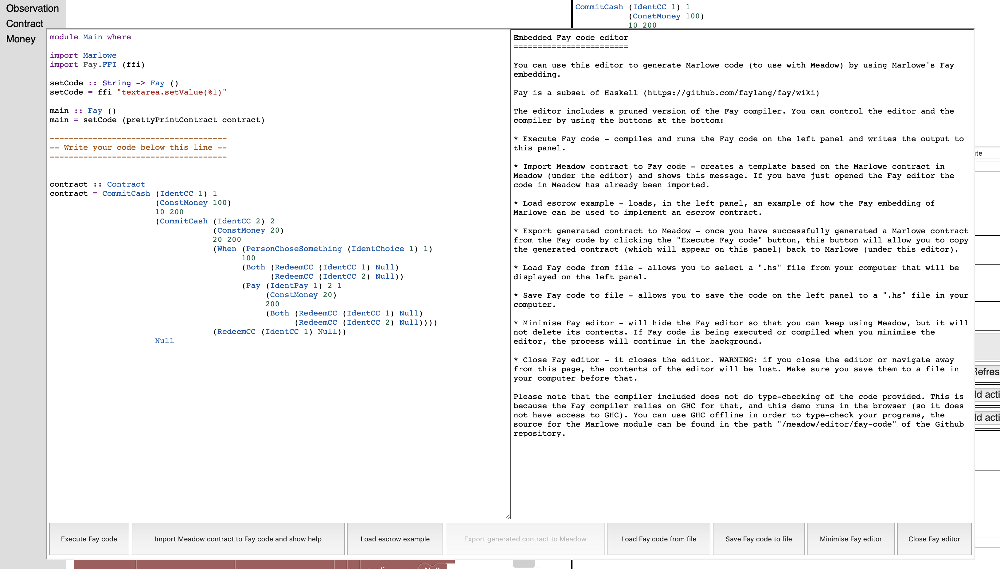
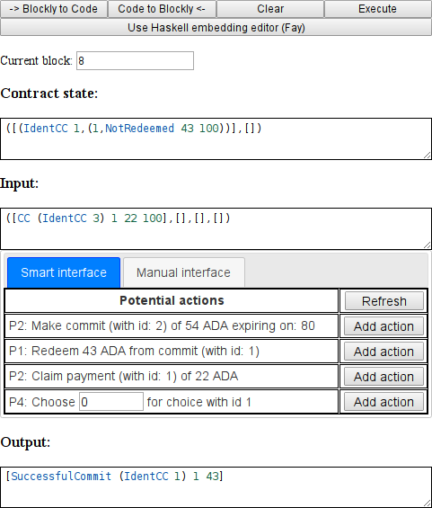

# An overview of Meadow

This tutorial gives an overview of Meadow, a tool that allows users to interact with and simulate the operation of Simeon contracts and embedded Simeon contracts. Meadow is available at [https://The-Blockchain-Company.github.io/simeon/](https://The-Blockchain-Company.github.io/simeon/).

## Introducing Meadow

For Simeon to be usable in practice, users need to be able to understand how contracts will behave once deployed to the blockchain, but without doing the deployment. We can do that by simulating their behaviour off-chain, interactively stepping through the evaluation of a contract in a browser. We do this in two stages, first transforming an embedded contract (using features of Haskell) to a pure Simeon contract, and then interactively stepping through that contract. 

This is achieved in  Meadow, a web tool that supports the interactive construction, revision, and simulation of smart-contracts written in Simeon. 

The figure shows a screenshot of Meadow in the middle of simulating the execution of the _deposit incentive_ contract available in the GitHub repository in the file [`DepositIncentive.hs`](https://github.com/The-Blockchain-Company/simeon/blob/v1.3/src/DepositIncentive.hs) and in the examples section of Meadow (to the bottom right of the screen).

The Blockly editor allows the user to visualise and edit smart-contracts as interlocking blocks that can be dragged and dropped like pieces of a jigsaw puzzle. Meadow also provides functionality to generate syntactically correct and formatted code (that is displayed in the upper right corner of the application), and to convert the code back to its Blockly representation. As in the semantics for Simeon, we use integers to model people; on blockchain we will use public keys for this purpose.

Additionally, Meadow allows the user to edit and evaluate embedded Simeon contracts into “pure” Simeon using an embedded editor, which is presented as an overlay to the main view of Simeon.

In using Meadow, you are able to scroll (as indicated by the scrollbars that appear) and to cut, paste and scale using the keyboard shortcuts of your OS and browser: e.g. on Mac OS using  &#8984;-C,  &#8984;-V,  &#8984;-+ etc.

The implementation of Meadow includes a pruned copy of the Fay compiler, which implements a subset of Haskell, but without type checking, The compiler is bundled with its Prelude module, its foreign interface, and a module with the definitions of the Simeon primitives and a function to pretty-print Simeon contracts. This allows the user to compile and execute, inside Meadow, Fay code that generates and prints a Simeon contract. When the user opens the embedded editor, the current Simeon contract is embedded into a template of a Fay program that prints it. The user is able to modify this code in the left panel of the editor and use the advanced functionalities provided by Fay including, for example, bindings, list-comprehensions, Turing-complete function definitions, etc.

When the user clicks the execute button, the Fay code is compiled to JavaScript and evaluated; this causes the Simeon contract generated by the execution of the code to be written to the panel on the right. Generated contracts can then be sent back to the main screen of Meadow, translated to Blockly, and their execution can be simulated. The embedded editor also allows users to save the Fay code to a file, to load code from a file, and to temporarily hide the editor while keeping its contents in memory, even while the compilation and execution process is being carried out in the background.

The execution of complete contracts can be simulated block by block by using the panel on the right, shown in detail below. This includes text fields to view and edit the current block number, the state of the contract, the current inputs, and the outputs from last block.

Additionally, to facilitate the introduction of inputs, Meadow provides two different interfaces:

 - The manual interface, provides a template for each of the four possible types of input: commits, redeems, payment claims, and choices.

 - The smart interface (shown in the figure above), calculates the possible operations that would make sense given the current inputs, state of the contract, block number, and remaining contract; and it provides them in a table with most of the parameters already filled in.

The smart interface is usually more convenient to use than the manual interface since the later provides between 3 and 4 fields for each operation whereas the former predicts the possible intentions of the user and usually can input new operations with a single click (except for choices, which still may require the user to input a number).

> __Exercise__
>  
> Use Meadow to interact with the `escrow` contract in the various scenarios discussed earlier, in the tutorial on [using Simeon](./using-simeon.md).
>
> Explore making some changes to the contract, and interactions with those modified contracts.
> 

> __Exercise__
>  
> Use Meadow to explore the other contracts presented in Meadow: the deposit incentive contract, and the crowd-funding example.
> 

## Where to go to find out more 
- A video showing Meadow in action: [link](https://youtu.be/_loz70XkHM8)
- More details about the implementation of Meadow can be found in [our paper](https://tbco.io/research/papers/#2WHKDRA8).

### [Prev](./using-simeon.md)  [Up](./README.md) [Next](./actus-simeon.md)
