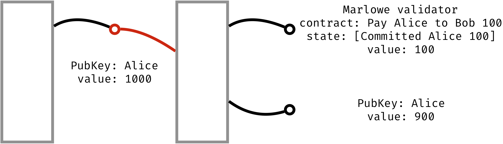
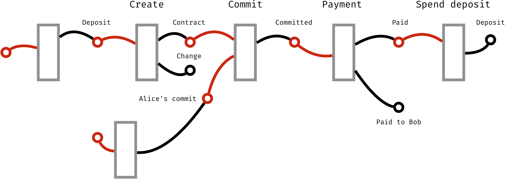
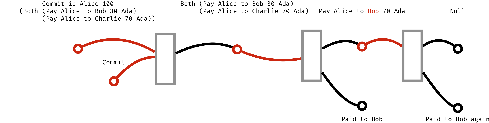

# Implementing Simeon in Zerepoch

So far these tutorials have dealt with Simeon as a “stand alone” artefact; this tutorial describes how Simeon is implemented on blockchain, using the “mockchain” that provides a high-fidelity simulation of the Bcc SL layer.

## Implementation

To implement Simeon contracts we use the ZerepochTx compiler, which compiles Haskell code into serialized Zerepoch Core code, to create a Bcc _validator script_ that ensures the correct execution of the contract. This form of implementation relies on the extensions to the UTxO model that are described in [this overview](https://github.com/The-Blockchain-Company/zerepoch/blob/master/docs/extended-utxo/README.md).

Simeon contract execution on the blockchain consists of a chain of transactions where, at each stage, the remaining contract and its state are passed through the _data script_, and actions and inputs (i.e. _choices_ and _oracle_ values) are passed as _redeemer scripts_. Each step in contract execution is a transaction that spends a Simeon contract script output by providing a valid input in a redeemer script, and produces a transaction output with a Simeon contract as continuation (remaining contract) in addition to other inputs and outputs.

## Design space

There are several ways to implement Simeon contracts on top of Zerepoch. We could write a Simeon to Zerepoch compiler that would convert each Simeon contract into a specific Zerepoch script. Instead, we chose to implement an interpreter of Simeon contracts. This approach has a number of advantages:

- It is simple: we implement a single Zerepoch script that can be used for all Simeon contracts, thus making it easier to implement, review, and test what we have done.
- It is close to the semantics of Simeon, as described in the [earlier tutorial](./simeon-semantics.md), so making it easier to validate.
- It means that the same implementation can be used for both on- and off-chain (wallet) execution of Simeon code.
- It allows client-side contract evaluation, where we reuse the same code to do contract execution emulation (e.g. in IDE), and compile it to WASM/JavaScript on client side (e.g. in the Zerepoch or Simeon Playground).
- Having a single interpreter for all (or a particular group of) Simeon contracts allows to monitor the blockchain for these kinds of contract, if desired.
- Finally, there is a potential to special-case this sort of script, and implement a specialized, highly effective interpreter in Bcc CL itself.

In our implementation, we store the remaining contract in the _data script_ (see Section 4), which makes it visible to everyone. This simplifies contract reflection and retrospection.

## Contract lifecycle on extended UTxO model

The current implementation works on the mockchain, as described in [the Wallet API](https://github.com/The-Blockchain-Company/zerepoch/blob/master/zerepoch-tutorial/tutorial/Tutorial/02-wallet-api.md). We expect to have to make only minimal changes to run on the production implementation because the mockchain is designed to be faithful to that.

As we described above, the Simeon interpreter is realised as a _validation script_. 
We can divide the execution of a Simeon Contract into three phases: initialization/creation, execution and completion.

__Initialization/Creation.__ Contract initialization and creation is realised as a transaction with at least one script output (currently it must be the first output), with the particular Simeon contract in the data script, and protected by the Simeon validator script. The transaction has to put some money (at least one Entropic) on that transaction output, in order for it to become an unspent transaction output (UTxO). We consider this value a _contract deposit_, which can be spent during the completion phase. Note that we do not place any restriction on the transaction inputs, which could use any other transaction outputs, including scripts. It is possible to initialize a contract with a particular state, containing a number of commitments, as shown here.



__Execution.__ Simeon contract execution consists of a chain of transactions, where the remaining contract and state are passed through the _data script_, and actions and inputs (i.e. _choices_ and _oracle_ values) are passed as _redeemer scripts_.

Each step is a transaction that spends a Simeon contract script output by providing a valid input in a redeemer script, and produces a transaction output with a Simeon contract as continuation, as can be seen here.



The Simeon interpreter first validates the current contract and state. That is, we check that the contract correctly uses identifiers, and holds at least what it should, namely the deposit and the outstanding commitments.

We then evaluate the continuation contract and its state, using the `eval` function, 
```haskell
eval :: Input → Slot → Bcc → Bcc → State → Contract → (State,Contract,Bool)
```
using the current slot number and at the same time checking that the input makes sense and that payments are within committed bounds; if the input is valid then it returns the new `State` and `Contract` and the Boolean `True`; otherwise it returns the current `State` and `Contract`, unchanged, together with the value `False`.

In a little more detail, in the type of `eval` above, `Input` is a combination of contract participant actions (i.e. `Commit`, `Payment`, `Redeem`), oracle values, and choices made. The two Bcc parameters are the _current_ contract value, and the _result_ contract value. So, for example, if the contract is to perform a 20 Bcc Payment and the input current amount is 100 Bcc, then the result value will be 80 Bcc. The `Contract` and `State` values are the current contract and its `State`, respectively, taken from the data script.

In general, on-chain code cannot generate transaction outputs, but can only validate whatever a user provides in a transaction. Every step in contract evaluation is created by a user, either manually or automatically (by a wallet, say), and published as a transaction. A user may therefore provide any `Contract` and its `State` as continuation. For example, consider the following contract
```haskell
Commit id Alice 100 (Both (Pay Alice to Bob 30 Bcc) (Pay Alice to Charlie 70 Bcc))
```
`Alice` commits 100 Bcc and then both `Bob` and `Charlie` can collect 30 and 70 Bcc each by issuing the relevant transaction. After `Alice` has made a commitment the contract becomes
```haskell
  Both (Pay Alice to Bob 30 Bcc) (Pay Alice to Charlie 70 Bcc)
```  
`Bob` can now issue a transaction with a `Payment` input in the redeemer script, and a script output with 30 Bcc less value, protected by the Simeon validator script and with data script containing the evaluated continuation contract
```haskell
  Pay Alice to Charlie 70 Bcc
```  
`Charlie` can then issue a similar transaction to receive remaining 70 Bcc.

__Ensuring execution validity.__ Looking again at this example, suppose instead that `Bob` chooses, maliciously, to issue a transaction with the following continuation:
```haskell
  Pay Alice to Bob 70 Bcc
```  
and take all the money, as in here, making Charlie reasonably disappointed with all those smart contracts. 



To avoid this we must ensure that the continuation contract we evaluate is equal to the one in the data script of its transaction output.

This is the tricky part of the implementation, because we only have the _hash_ of the data script of transaction outputs available during validator script execution. If we were able to access the data script directly, we could simply check that the expected contract was equal to the contract provided. But that would further complicate things, because we would need to know types of all data scripts in a transaction, which is not possible in general.

The trick is to require the `input redeemer script` and the `output data script` to be equal. Both the redeemer script and the data script have the same structure, namely a pair `(Input, SimeonData)` where

 - The Input contains contract actions (i.e. `Payment`, `Redeem`), `Choices` and `Oracle` values.
 - `SimeonData` contains the remaining `Contract` and its `State`.
 - The `State` here is a set of `Commits` plus a set of `Choices` made.

To spend a transaction output secured by the Simeon validator script, a user must provide a redeemer script, which is a tuple of an `Input` and the expected output of interpreting a Simeon contract for the given `Input`, i.e. a `Contract`, `State` pair. The expected contract and state can be precisely evaluated beforehand using `eval` function.

To ensure that the user provides valid remaining `Contract` and `State`, the Simeon validator script will compare the evaluated contract and state with those provided by the user, and will reject a transaction if those do not match.
To ensure that the remaining contract’s data script has the same `Contract` and `State` as was passed with the redeemer script, we check that data script hash is the same as that of the redeemer script.

__Completion.__ When a contract evaluates to `Null`, and all expired `Commits` are redeemed, the initial contract deposit can be spent, removing the contract from the set of unspent transaction outputs.


>
> __Exercise__
>  
> _Advanced._  Explore running Simeon contracts in Zerepoch. In order to be able to 
> do this you will need to use the latest version of Simeon, rather than `v1.3`.


## Where to go to find out more 

- The ZerepochTX tutorial [link](https://github.com/The-Blockchain-Company/zerepoch/blob/master/zerepoch-tutorial/tutorial/Tutorial/01-zerepoch-tx.md)
- The Wallet API tutorial [link](https://github.com/The-Blockchain-Company/zerepoch/blob/master/zerepoch-tutorial/tutorial/Tutorial/02-wallet-api.md)
- The extended UTxO model [link](https://github.com/The-Blockchain-Company/zerepoch/blob/master/docs/extended-utxo/README.md)


### [Prev](./actus-simeon.md) [Up](./README.md) [Next]()